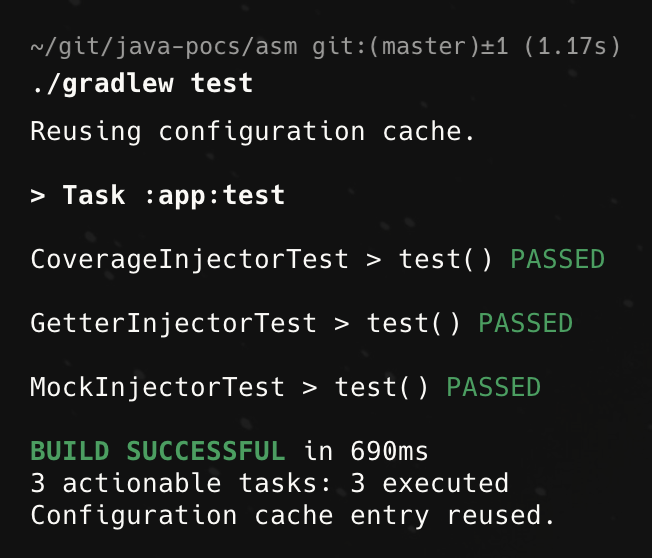

# ASM

- [Official website](https://asm.ow2.io/#:~:text=ASM%20is%20an%20all%20purpose%20Java%20bytecode%20manipulation%20and%20analysis%20framework.%20It%20can%20be%20used%20to%20modify%20existing%20classes%20or%20to%20dynamically%20generate%20classes,%20directly%20in%20binary%20form.)

## Hello, World!

**Print Injector**

- [Package](app/src/main/java/org/example/printinjector)

## Main types and methods

**ClassVisitor**

1. [visit(...)](https://asm.ow2.io/javadoc/org/objectweb/asm/ClassVisitor.html#visit(int,int,java.lang.String,java.lang.String,java.lang.String,java.lang.String%5B%5D))

Example:

```java
public class Greeter {
}
```

```java
cv.visit(
    Opcodes.V1_8,
    Opcodes.ACC_PUBLIC,
    "Greeter",
    null, // No signature (null means not generic).
    "java/lang/Object",
    null // No interfaces.
);
```

2. [visitMethod(...)](https://asm.ow2.io/javadoc/org/objectweb/asm/ClassVisitor.html#visitMethod(int,java.lang.String,java.lang.String,java.lang.String,java.lang.String%5B%5D))

Example:

```java
public void greet() {
    System.out.println("Hello!");
}
```

```java
cv.visitMethod(
    Opcodes.ACC_PUBLIC,
    "greet",
    "()V", // Descriptor (no params, returns void).
    null, // No generics.
    null // No exceptions thrown.
);
```

3. [visitField(...)](https://asm.ow2.io/javadoc/org/objectweb/asm/ClassVisitor.html#visitField(int,java.lang.String,java.lang.String,java.lang.String,java.lang.Object))

Example:

```java
private static final int count = 10;
```

```java
cv.visitField(
    Opcodes.ACC_PRIVATE | Opcodes.ACC_STATIC | Opcodes.ACC_FINAL,
    "count",
    "I", // Descriptor (I = int).
    null, // No generics.
    Integer.valueOf(10)
);
```

**MethodVisitor**

1. [visitFieldInsn(...)](https://asm.ow2.io/javadoc/org/objectweb/asm/MethodVisitor.html#visitFieldInsn(int,java.lang.String,java.lang.String,java.lang.String))

Example:

```java
mv.visitFieldInsn(
    Opcodes.GETSTATIC,
    "java/lang/System",
    "out",
    "Ljava/io/PrintStream;"
);
```

2. [visitMethodInsn(...)](https://asm.ow2.io/javadoc/org/objectweb/asm/MethodVisitor.html#visitMethodInsn(int,java.lang.String,java.lang.String,java.lang.String,boolean))

Example:

```java
mv.visitMethodInsn(
    Opcodes.INVOKEVIRTUAL,
    "java/io/PrintStream",
    "println",
    "(Ljava/lang/String;)V",
    false // Not an interface.
);
```

[**Opcodes**](https://asm.ow2.io/javadoc/org/objectweb/asm/Opcodes.html)

## POCs

**Getter Injector**

- [Package](app/src/main/java/org/example/getterinjector)
- [Test](app/src/test/java/org/example/getterinjector/GetterInjectorTest.java)

**Mock Injector**

- [Package](app/src/main/java/org/example/mockinjector)
- [Test](app/src/test/java/org/example/mockinjector/MockInjectorTest.java)

**Coverage Injector**

- [Package](app/src/main/java/org/example/coverageinjector)
- [Test](app/src/test/java/org/example/coverageinjector/CoverageInjectorTest.java)

**Test results**



## JaCoCo

**Data Field**

- [Definition](https://github.com/jacoco/jacoco/blob/fc3726eaa6bd48c342d2c0c41b62297d7be4928a/org.jacoco.core/src/org/jacoco/core/internal/instr/InstrSupport.java#L37)
- [Creation](https://github.com/jacoco/jacoco/blob/fc3726eaa6bd48c342d2c0c41b62297d7be4928a/org.jacoco.core/src/org/jacoco/core/internal/instr/ClassFieldProbeArrayStrategy.java#L67)


The `createInitMethod` function generates something equivalent to this (in bytecode):

```java
static boolean[] $jacocoInit() {
    if (__$jacocoData != null) return __$jacocoData;
    __$jacocoData = new boolean[probeCount];
    return __$jacocoData;
}
```

**Probe**

- [Insertion](https://github.com/jacoco/jacoco/blob/fc3726eaa6bd48c342d2c0c41b62297d7be4928a/org.jacoco.core/src/org/jacoco/core/internal/instr/ProbeInserter.java#L81)

The `insertProbe(int id)` function generates something equivalent to this (in bytecode):

```java
__$jacocoData[id] = true;
```

So, suppose your application defines the following method:

```java
void foo() {
    if (x > 0)
        doSomething();
    else
        doOtherThing();
}
```

Then, JaCoCo might instrument it like this:

```java
void foo() {
    $jacocoData[0] = true;
    if (x > 0) {
        $jacocoData[1] = true;
        doSomething();
    } else {
        $jacocoData[2] = true;
        doOtherThing();
    }
}
```