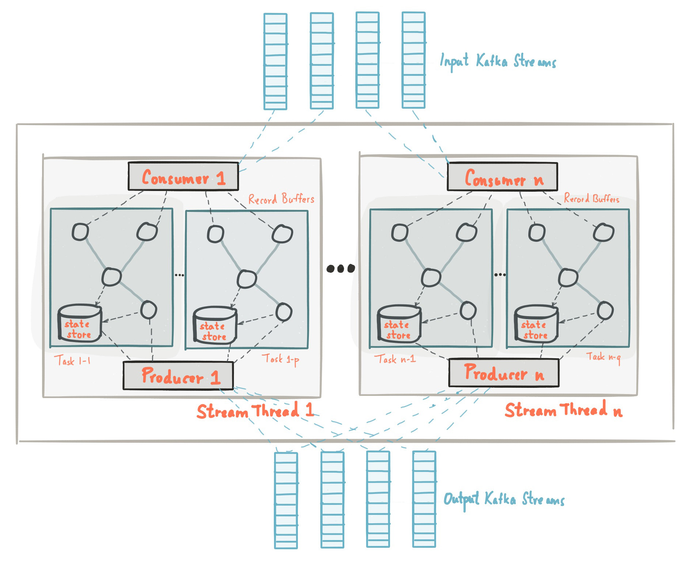

# Kafka Streams

## What is Kafka Streams?

- A Java/Scala library.
- A stream processing engine.
- An API for transforming data stored in Kafka topics.

## Real use cases

- ...

## Architecture



## POCs

### Word count

Code:
```java
var builder = new StreamsBuilder();

KStream<String, String> textLines = builder.stream(TEXT_LINES_TOPIC);
KTable<String, Long> wordCounts = textLines
        .flatMapValues(textLine -> Arrays.asList(textLine.toLowerCase().split("\\W+")))
        .groupBy((_, word) -> word)
        .count(Materialized.as("counts-store"));
wordCounts.toStream().to(WORD_COUNTS_TOPIC, Produced.with(Serdes.String(), Serdes.Long()));

var streams = new KafkaStreams(builder.build(), props);
streams.start();
```

Input:
```
app-1  | Produced message: hello world
app-1  | Produced message: hello kafka
app-1  | Produced message: hello kafka streams
```


Output:
```
app-1  | Consumed message: hello=3
app-1  | Consumed message: world=1
app-1  | Consumed message: kafka=2
app-1  | Consumed message: streams=1
```

### Clicks by region

Code:
```java
var builder = new StreamsBuilder();

KStream<String, Long> userClicks = builder.stream(USER_CLICKS_TOPIC, Consumed.with(Serdes.String(), Serdes.Long()));
KTable<String, String> userRegions = builder.table(USER_REGIONS_TOPIC);
KTable<String, Long> clicksByRegion = userClicks
        .leftJoin(userRegions, (clicks, region) ->
                new ClicksByRegion(region == null ? "UNKNOWN" : region, clicks))
        .map((_, cbr) -> KeyValue.pair(cbr.region, cbr.clicks))
        .groupByKey(Grouped.with(Serdes.String(), Serdes.Long()))
        .reduce(Long::sum);
clicksByRegion.toStream().to(CLICKS_BY_REGION_TOPIC, Produced.with(Serdes.String(), Serdes.Long()));

var streams = new KafkaStreams(builder.build(), props);
streams.start();
```

Input:
```
app-1  | Produced message: alice=asia
app-1  | Produced message: bob=americas
app-1  | Produced message: charlie=asia
app-1  | Produced message: david=europe
app-1  | Produced message: alice=europe
app-1  | Produced message: eve=americas
app-1  | Produced message: frank=asia
```
```
app-1  | Produced message: alice=13
app-1  | Produced message: bob=4
app-1  | Produced message: charlie=25
app-1  | Produced message: bob=19
app-1  | Produced message: david=56
app-1  | Produced message: eve=78
app-1  | Produced message: alice=40
app-1  | Produced message: frank=99
```

Output:
```
app-1  | Consumed message: americas=101
app-1  | Consumed message: europe=109
app-1  | Consumed message: asia=124
```

## Competitors

| Criterion        | Kafka Streams     | Spark and Flink             |
| ---------------- | ----------------- | --------------------------- |
|                  | Java library      | Master-slave cluster        |
|                  | Stream processing | Stream and batch processing |
|                  |                   | Require an external file system like S3 or HDFS |
|                  | Limited to Kafka (requires Kafka Connect for integration with other systems) | Multiple sources and sinks  |
| Language support | Java, Scala       | Java, Scala, Python, SQL    |